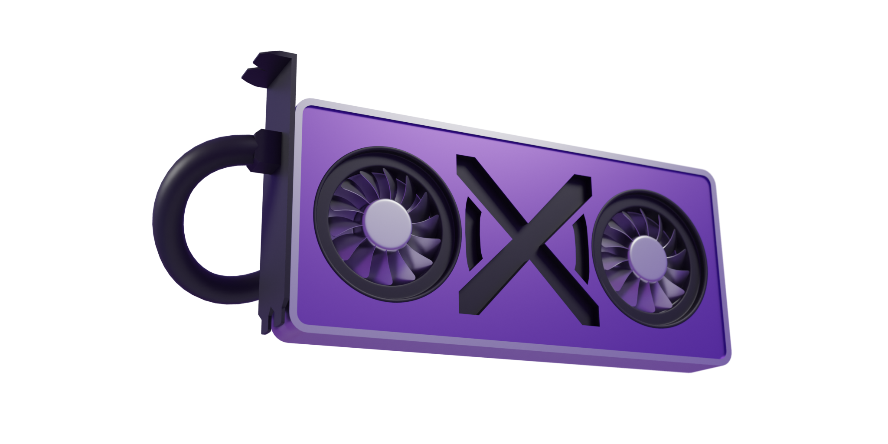

  <!-- <a href="https://github.com/Ipotrick/Daxa"> -->
    
  <!-- </a> -->

# Daxa

Daxa is my personal opinionated GPU API abstraction over Vulkan.

Daxa is close to Vulkan, with some key abstractions that make it much more convenient to use. Daxa does this without losing flexibility or performance on modern desktop GPUs.

The original goal of Daxa was to have a GPU library that was as easy (or easier) to use than OpenGL, while retaining the good aspects of the Vulkan API.
I am happy to say that for me it achieves that goal now.

## Key features and abstractions
- [x] Simple setup and object creation. No more 1000 LOC file to get a triangle drawn (https://github.com/Ipotrick/Daxa/tree/master/wiki/Tutorial.md).
- [x] Automatic deferred resource destruction, waiting on possible use from the GPU.
- [x] Powerful and flexible render-graph implementation. (https://github.com/Ipotrick/Daxa/tree/master/wiki/TaskList.md)
- [x] Bindless shader resource model. (https://github.com/Ipotrick/Daxa/tree/master/wiki/Bindless.md)
- [x] C++ and shader code sharing utilities. (https://github.com/Ipotrick/Daxa/tree/master/wiki/ShaderIntegration.md)
- [x] Shader build system, including features like `#include` management and shader hot-reloading. (https://github.com/Ipotrick/Daxa/tree/master/wiki/PipelineManager.md)

## Getting started

Daxa has a GitHub wiki explaining how to build it [here](https://github.com/Ipotrick/Daxa/wiki/Building).

The GitHub wiki also contains pages on all bigger Daxa features like TaskList and the shader integration.

In addition to that, the Daxa repository has a set of example projects using Daxa in the tests folder.

Daxa also has a [tutorial wiki page](https://github.com/Ipotrick/Daxa/tree/master/wiki/Tutorial.md).

If you prefer to interact in discord over github issues, daxa has a [discord server](
https://discord.gg/MJPJvZ4FK5).

## Design Goals

Daxa is meant to be internally very simple and clean. This is important as I and the other maintainers ([Gabe](https://www.github.com/GabeRundlett) and [Saky](https://github.com/MatejSakmary)) want to be able to easily keep it clean bug free and maintainable. Having a smaller codebase makes all these things much easier. Because of this, Daxa routinely completely removes unused features and reworks parts to keep clean.

Backwards compatibility is a low priority. Reworks are frequent but are getting much less necessary now. We release stable versions from time-to-time.

Daxa imposes as minimal overhead in most parts of the API, compared to raw Vulkan.

Daxa is made in two layers. The core API and the utils. The utils contain things like the ImGui integration, PipelineManager and TaskList. This split is made to keep the responsibilities of the different parts of Daxa strictly separated.
